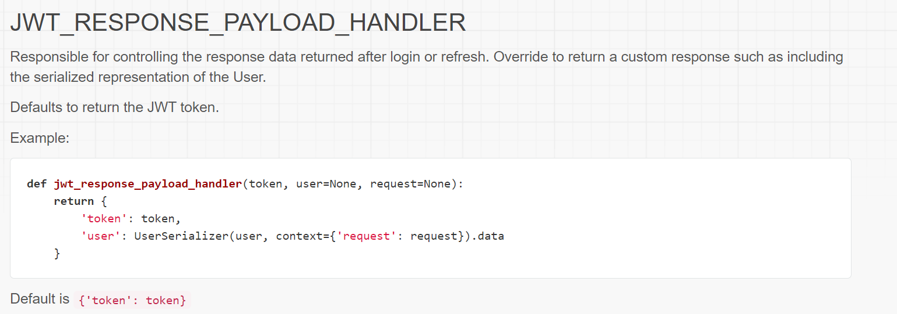

# Journal Entry

**Date**: `Sunday 01 November, 2020`

**Hours worked**: `3`

## Tasks Completed
- Added floating button to the client-side
- Added (modified) JWT authentication help to the server-side.
- Research on Gannt chart and work schedule.

## Summary
On Sunday, the group had individual tasks that they completed, which involved some client-side, server-side and documentation work. In the case of documentation, we made a reusable gannt chart and work schedule that could be adjusted for each sprint documentation.

The server-side also had some modifications done to the JWT authentication aspects, where custom data was encode in the JWT token to help the client-side specify the role of the user (whether it is a customer or a pharmacist) in order to allow access to specific pages.

On the client-side, the task I was trying to achieve, was to create a floating button on the bottom right of the page, which is used to create a new order to a pharmacy. Thankfully the ionic documentation has much details on how to create/customize a floating button with tutorials showing what a user could do after clicking on it (in our case, open a form)

So the final application button looked like this:

The more I get to try out these example types from Ionic, the more I get comfortable with the syntax of typescript and understanding how ionic and angular works together. In this case, I got to know how Ionic deals with its custom html elements and how that effects IOS and android devices differently.