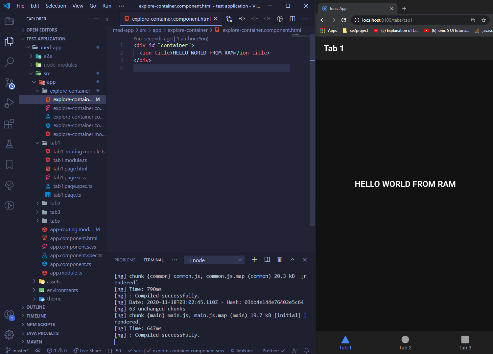
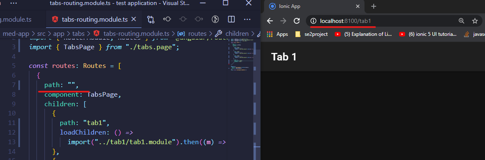

# Journal Entry

**Date**: `Friday 02 October, 2020`

**Hours worked**: `4`

## Tasks Completed
- Added Ionic frontend auto-generated menu template app 
  
## Summary
  This day was about learning more about Ionic and Angular. As for the application, an moke-up was created using the basic ionic template, which allowed me to explore more about the routing aspects of angular and how to manipulate the code to see some custom output.

  

  By editing routes, I was able to edit some of the internal structure of the application and what the url was directing to the

  

  The team decided use this template as the project progresses which will need more research on how to handle roles when the app is used by either a customer or a pharmacist.
  

