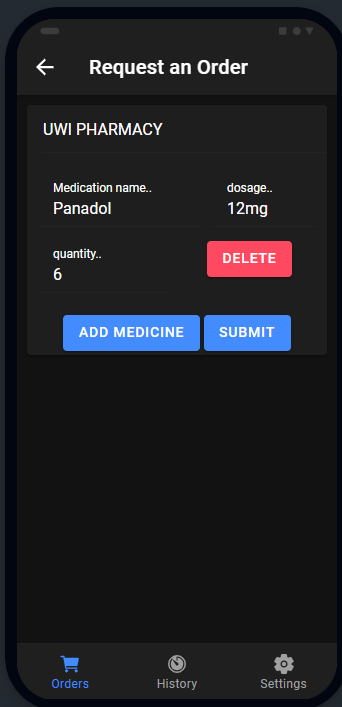
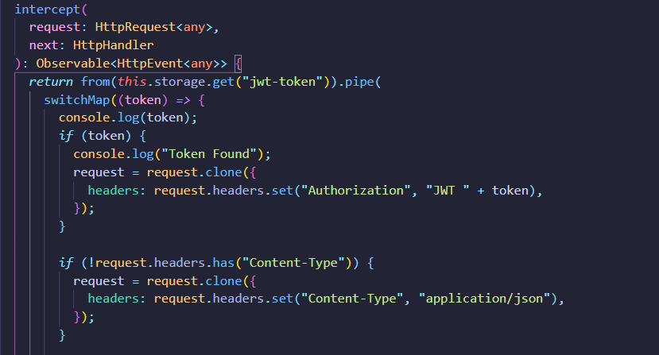
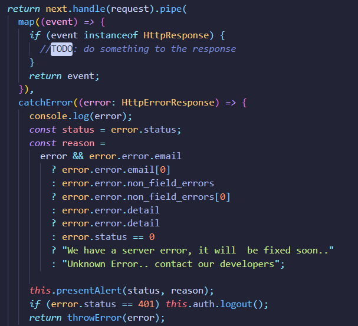
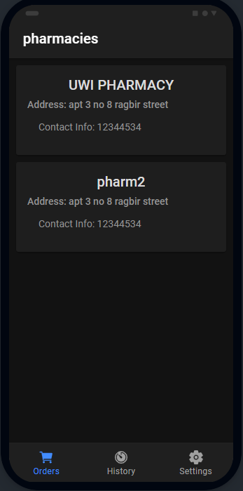

# Journal Entry

**Date**: `Tuesday 03 November to Sunday 08 November, 2020`

**Hours worked**: `12`

## Tasks Completed

- Order request form was created
- dynamic pharmacy list
- Created httpInterceptor
  

## Summary
Starting the week, The goal was to get as much implementation done as possible on the server-side. So on Sunday the 3rd, the development of the order request form was started. 

**What the final form looked like**

At the start of the development of the request form, the form input fields were:
- Patient name (Later removed since the orders linked to the user of the account)
- Pharmacy (implemeneted later in the week with dynamic pharmacy loading)
- medication (originally this was one but text field but as the week went it was changed to these three separate cases)
  - medication name
  - dosage
  - quantity

The form was created using this [Fireship tutorial on reactive forms for angular](https://www.youtube.com/watch?v=JeeUY6WaXiA), the principle was to create a form where the logic(validation and post) is handled more pragmatically using typescript than through html.

Data validation took the most time in this case due to Angular 's complexity in working with the dom. but as the time went on, more information was collected through the  [Angular documentation](https://angular.io/guide/form-validation).

This also allowed me to play with routing in ionic and creating fragments that can be called and send data between fragments.

*The next couple of days* was about creating an [http interceptor](https://angular.io/api/common/http/HttpInterceptor) this **little** piece of code will be responsible for stopping any http requests made by the client-side, modifying it by adding missing headings (such as Authorization header and Content-type) and send the http request. This will help to easily make any request from anywhere in the app, without worrying about additional header requirements. This interceptor is also responsible for handling errors that is returned as a response from the server-side api.

**The code responsible for adding the auth and content-type in the interceptor**

**Code responsible fore handling any errors thrown by the server**

The error handling uses [Ionic alertController](https://ionicframework.com/docs/v3/api/components/alert/AlertController/) to display a message informing the user of the type of error.

*The next step involved* adding some multi-role functionality fro the client-side. Since we have 2 types of users (Pharmacist and customers), this stage also edited our ERD a little bit where we had to add a role to the user model to handle this behavior. At this time the app can only distinguish the users, but nothing has changed in the UI.

Towards the end of the week, I implemented a way to load the pharmacies by asking the server to provide a list of pharmacies. This allows the user to see a dynamic list of pharmacies and see new pharmacies as they are sent tot he server.

**Pharmacy page of the app taht loads pharmacies dynamically**

The rest of the week was spent fixing bugs that occurred when connecting to the live server. As the previous steps were done using *fake data* generated inside client. Problems were mostly due to the synchronous nature of js, which was solved using [observables from rxjs](https://rxjs-dev.firebaseapp.com/guide/observable).

