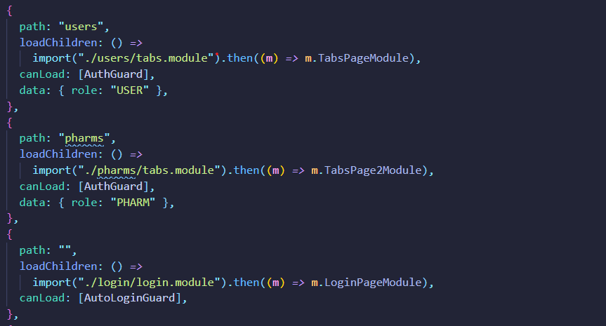
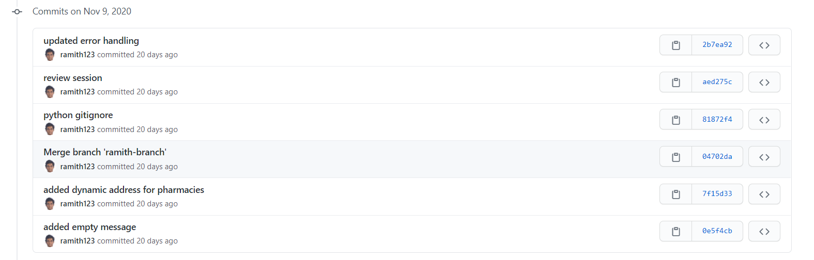
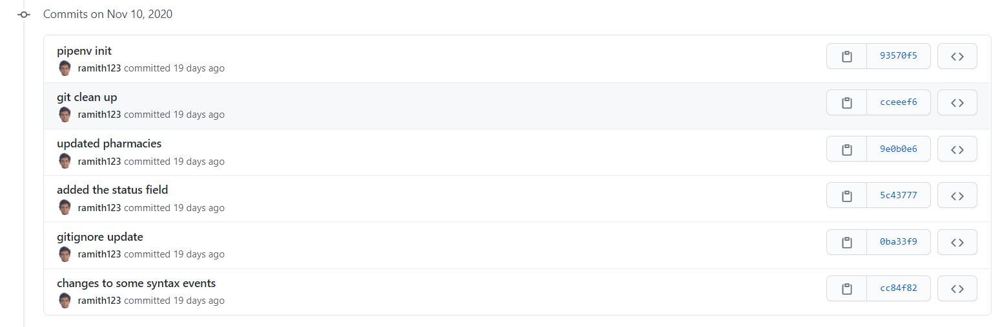
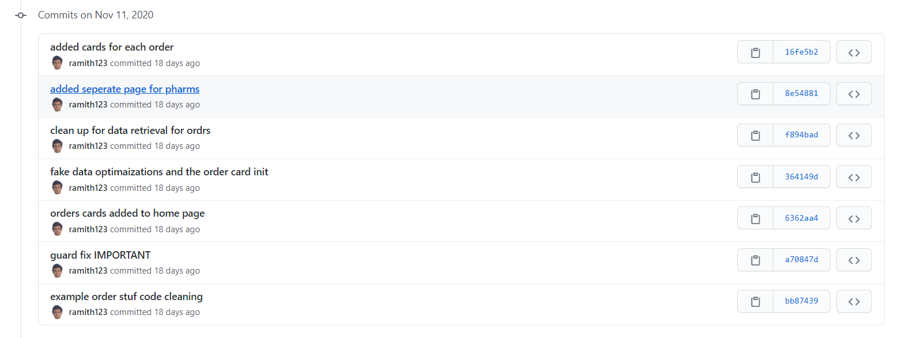

# Journal Entry

**Date**: `Monday 09 November to Sunday 16 November, 2020`

**Hours worked**: `8`

## Tasks Completed

- AutoLogin for users
- Doing token authentication fixes
- Error handling update

## Summary

The first 4 hours were spent on creating an auto login procedure for suers in the applications. This involved guiding the type users to the correct url as well as storing the token on storage and retrieving it when a user opens the app. This guide was found at [Simon Grimm - Ionic 5 app navigation with login, Guards and Tabs area.](https://www.youtube.com/watch?v=RuuOdfz9Kxc)

The guards were applied to the routes that the users are allowed to access as seen in the image below.

**Above shows the guard and the path the guard is applied to**

The guards role is to only allow certain types of users to each path. This will ensure that only an authorized role is able to access certain pages.

Next implementation was fixing token authentication, since a [decoded JWT](https://jwt.io/) contains user data, only this was stored in local storage. But due to JWT encoding issues on the server-side due to time constraints, the role was separately stored in the application.

**Local storage of the application taken from google chrome dev tools.**

Rest of the time was more bug fixes when connecting to the server and more ui enhancements. Below are all the commits with a brief explanation on what was done

