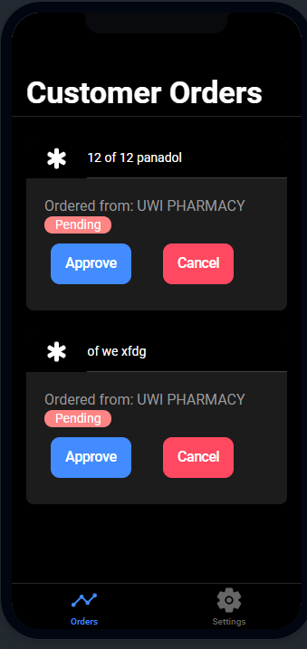

# Journal Entry

**Date**: `Tuesday 17 November to Tuesday 24 November, 2020`

**Hours worked**: `14`

## Tasks Completed

- Pharmacist UI interface Added
- Statuses added for orders

## Summary

This week was mainly about creating an interface for pharmacists and creating status for orders.

This involved creating a separate tab interface for pharmacists where the only common tab between user and pharmacist are the settings page.

**Finished page for pharmacist**

The pharmacists will have a set of buttons that will be displayed depending on the status of each order, the statuses being:
- Pending
- Approved
- Cancelled
- Collected
  
  The status of each order will also be displayed on the user side

  

  **The Pharmacist page on the right (pharmacist clicked approved ont eh order) and user on the left**

The status display happens for each order and below are some example tags (not the final version) these tags are (again no the final version, color contrast and tweaks to teh sizes are needed)

