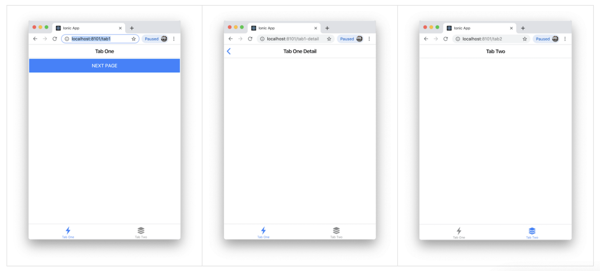
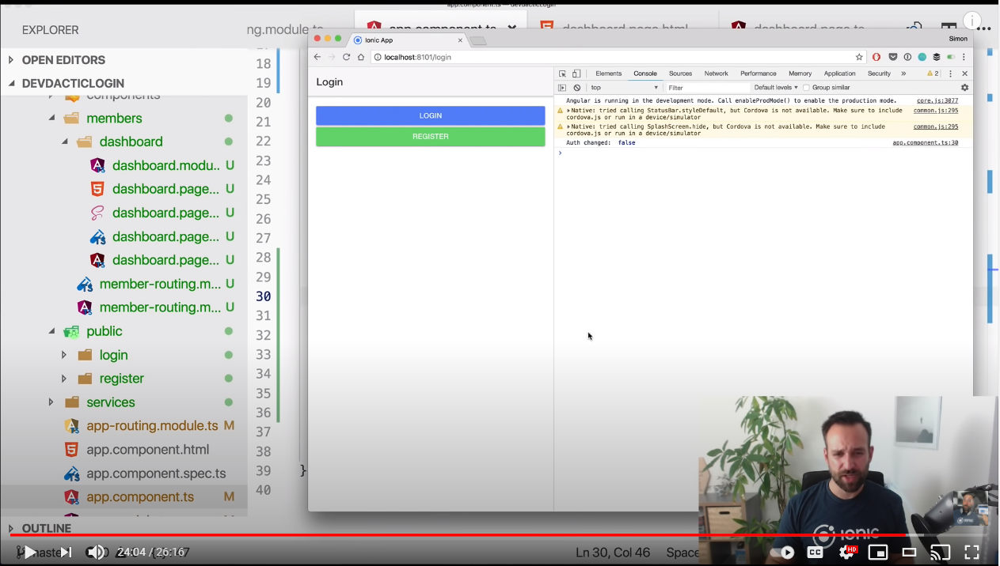
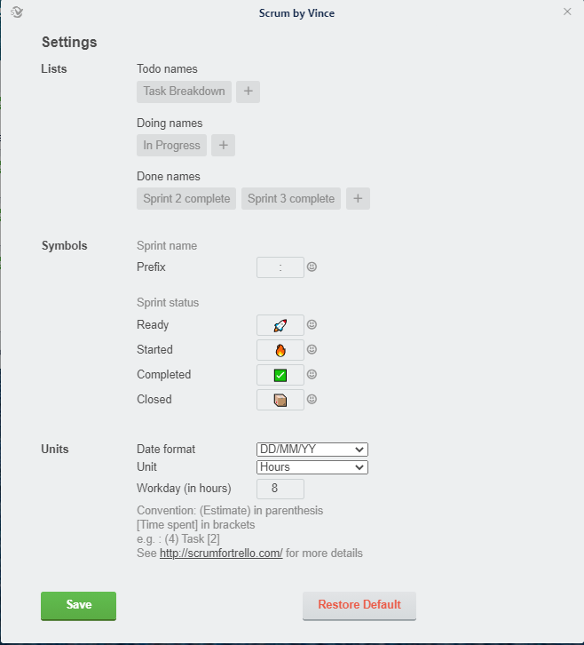
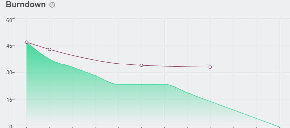

# Journal Entry

**Date**: `Thursday 8 October to Monday 19 October, 2020`

**Hours worked**: `9`

## Tasks Completed
  - start of sprint 1
 - Login page for the application and related code to make requests through the app
 - Documentation
   - UML diagram sketches
   - requirements
   - Use cases
   - Sprint log and backlog refinements

 - Trello setup and PowerUps added
 - Backend support for login and register

## Summary
After our initial meeting on the 7th about starting Sprint 1, The team split and worked on their designated tasks. I was tasked with creating the application skeleton, creating the login and registration (client-side) pages, and setting up Trello for future tracking of sprints.

For the application, I went with the Ionic tabs templates, which allowed us to have multiple pages in tabs form so the user can easily navigate between them.

The rest of the weeks were spent creating the login and register pages. The youtube channel [Simon Grimm](https://www.youtube.com/channel/UCZZPgUIorPao48a1tBYSDgg) was the main source of information as well as the [official ionic website](https://ionicframework.com/docs/components).

For trello, A software called [Scrum by Vince](https://trello.vince.run/scrum/) was used, which helped with the organizing of each sprint as well keeping track of a burndown chart.

This extension allows us to track our todo, Doing and Done lists within Trello and assign hours Estimate and time spent for each task, which helps generate the burndown chart.

 

 Burndown Example:

 

<!-- ## My Contributions
- Added starting pages of the application (skeletons)
- Created the login page and made a template to send and receive data from the backend server (pertaining to authorization and JWT).
- created a trello board with supporting power-up for sprints.

## Lessons Learned
- How to use behaviors and observables in angular (Rxjs)
- How to compile applications in ionic using capacitor
- More understandings of sprints, story points and time management when it comes to scrum
- More understanding on how Ionic works and how to handle (decode and manipulate) JWT in Ionic. -->
  
