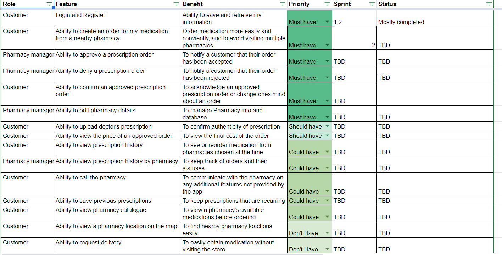

# Journal Entry

**Date**: `Thursday 24th September 2020`

**Hours worked**: `4`

## Tasks Completed

- Created a product backlog

## Summary

This day was focused on researching about product backlog and how to create one and prioritize features. The group came together on a call to finalize individual research that have done on the topic and we created a moke-up of the product backlog. 

I helped the team with listing out the features and identify some benefits for some of the features.
At the end we prioritize/ organized our features.

This session helped me to grasp a more detail understanding on how to choose and prioritize features for a product backlog and the importance of end-user involvement when creating a backlog.

<!-- 
- Researched on templates about how to create a backlog and how to prioritize features
- Helped with listing out features and identifying some benefits to said features.
- Helped the with creating the backlog template and prioritizing/organizing features.
-  -->

<!-- ## Lessons Learned

- The workings of a product backlog and how to choose and prioritize features in a product backlog. -->
