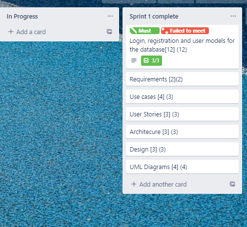
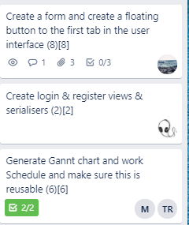

# Journal Entry

**Date**: `Monday 26 October to Friday 30 October, 2020`

**Hours worked**: `4`

## Tasks Completed
- plan for sprint 2
- Emergency meeting to confirm Certain sprint task breakdowns
-  Changed up required time for certain tasks.
-  Delegations of work for developers to phase themselves.

## Summary
During these few days, the team met up twice, firstly to have our sprint review and retrospective meetings, then to talk about how the development team(me and Jesse) failed meet the required user story (login and register) and how we would have to push that task/user-story to the next sprint.

The next meeting was about assigning our tasks to different team members which helped us plan sprint 2 more efficiently. Thankfully, Trello made it easy for us to assign tasks to team members.

<!-- ## My Contributions
- Participated in the meeting
## Lessons Learned
- Some time management skills and how to properly map out the task breakdowns -->

